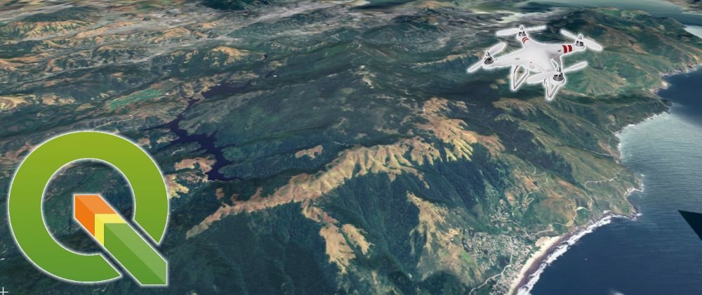
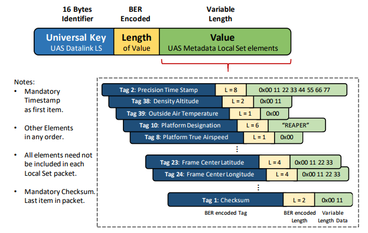
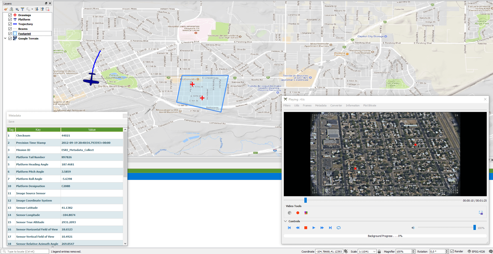

# QGIS Full Motion Video (FMV)  [#QGISFMV](https://twitter.com/hashtag/qgisfmv?f=live)

[](https://travis-ci.org/All4Gis/QGISFMV) 
[](https://www.openhub.net/p/QGISFMV)



Plugin for **QGIS 3** which allows to analyze, visualize and process videos inside the QGIS environment. **QGIS FMV** accepts multiple video formats such as _mp4, ts, avi_, etc. It is also able to extract video frames, to capture the current frame, to plot bitrate and to observe the video metadata with aerial images and more. It also offers the possibility to create reports with video metadata.

Standards supported:

  - "UAS Datalink Local Set", [ST0601.11](http://www.gwg.nga.mil/misb/docs/standards/ST0601.11.pdf)

## Table of Contents

- [Motivation](#motivation)
- [Dependencies](#dependencies)
- [For show video](#for-show-video)
- [Usage](#usage)
- [Recommended readings](#recommended-readings)
- [Installation](#installation)
    - [Installation on Windows](#installation-on-windows)
    - [Installation on Ubuntu](#installation-on-ubuntu)
    - [Installation on Archlinux](#installation-on-archlinux)
- [Slides](#slides)
- [Screenshots](#screenshots)
- [Features](#features)
- [Contributing](#contributing)
    - [Contributing Code](#contributing-code)
    - [Contributing translations](#contributing-translations)
	- [Contributors List](#contributors-list)
- [License](#license)
- [Donations](#donations)
	
## Motivation

This development arises after observing that there was no free solution for the metadata extraction and video analysis in real time. All solutions are APIs or private tools such as
[Esri](http://www.esri.com/products/arcgis-capabilities/imagery/full-motion-video) or [ImpleoTv](https://impleotv.com/),
for this reason, I decided to develop this open source project and, this way, offer this open source alternative to the QGIS community.

&#8593; [Back to top](#table-of-contents)

## Dependencies

* [FFMPEG](http://ffmpeg.org/download.html) : After downloading it, you should store it in an accessible folder and modify `settings.ini` with the corresponding path. For example `D://FFMPEG` or `/usr/bin/`

* [OpenCV](https://opencv.org/) : `python3 -m pip install opencv-python`

* [opencv-contrib-python](https://pypi.org/project/opencv-contrib-python/) : `python3 -m pip install opencv-contrib-python`

* [MatPlotLib](https://matplotlib.org/) : `python3 -m pip install matplotlib`

* [Klvdata](https://github.com/paretech/klvdata) : customized version of this library. (No need to install it)

The plugin install automatically this requisites,but you can install it using on Windows and Linux:

`python3 -m pip install -r requirements.txt`

Here is a **settings.ini** sample [Linux](code/settings_linux_sample.ini) configuration file  or [Windows](code/settings_win_sample.ini) sample

&#8593; [Back to top](#table-of-contents)

## For show video

To see the video you need:

  - **Linux**: install <a href="https://gstreamer.freedesktop.org/documentation/installing/on-linux.html" target="_blank">GStreamer dependencies</a>
  - **Window**: install LAV Filters (install <a href="https://github.com/Nevcairiel/LAVFilters/releases" target="_blank">DirectShow Media Decoders</a>) 
  
If everything works well the plugin should install these dependencies automatically in both, Windows and Linux.

&#8593; [Back to top](#table-of-contents)

## Usage

The use of this application is simple.
It only needs a video with metadata, like for example one of these [(ESRI copyright)](https://drive.google.com/open?id=1-B2uaW7_cfYZohZYFozrgBhIaztI1MSP)
Then, open the plugin where the "video manager" will be shown, open the video and with a double-click, the "player" will be opened. 
At this moment, you will see that new shapes have been added and you will see the platform position, metadata, etc.

If we don't have a MISB video we can create it from a video file and telemetry file from a DJI for example.

[Link to Usage Documentation!](https://all4gis.github.io/QGISFMV/Using)

&#8593; [Back to top](#table-of-contents)

## Recommended readings

For more information about the Unmanned Air System (UAS) metadata from STANAG 4609



* <a href="https://gisgeography.com/full-motion-video-fmv/" target="_blank">What is Full Motion Video (FMV)?</a>
* <a href="http://www.gwg.nga.mil/misb/faq.html" target="_blank">FAQ</a>
* <a href="http://www.gwg.nga.mil/misb/docs/nato_docs/STANAG_4609_Ed3.pdf" target="_blank">STANAG_4609_Ed3</a>
* <a href="http://www.gwg.nga.mil/misb/docs/standards/ST0601.13.pdf" target="_blank">ST0601.13</a>
* <a href="http://www.gwg.nga.mil/misb/docs/standards/ST0902.1.pdf" target="_blank">ST0902.1</a>

&#8593; [Back to top](#table-of-contents)

## Installation

The installation can be done from the QGIS Python Plugins Repository or from the [zip](https://github.com/All4Gis/QGISFMV/releases).


&#8593; [Back to top](#table-of-contents)

## Installation on Windows

Windows automatically installs all, with user permission,If an error occurs, you should perform some checks.

[](https://youtu.be/9C973pz5i6k "Como usa QGISFMV en windows")

## Installation on Ubuntu

Ubuntu automatically installs all the dependencies if the user wants, for this his password will be requested.

If it does not install automatically, you should run:

**Python dependencies**

`sudo pip3 install matplotlib python-apt`

The installation of **OpenCV** and **OpenCV-contrib** requires a lot of time for this reason you will have to install these dependencies using this [script](code/install-opencv.sh)

`sh install-opencv.sh`

**FFMPEG**

`sudo apt-get -y install ffmpeg`

**GStreamer/QT5 Plugins**

`sudo apt-get -y install python3-pyqt5.qtmultimedia gst123 libgstreamer1.0-0 gstreamer1.0-plugins-base gstreamer1.0-plugins-good gstreamer1.0-plugins-bad gstreamer1.0-plugins-ugly gstreamer1.0-libav gstreamer1.0-doc gstreamer1.0-tools gstreamer1.0-x gstreamer1.0-alsa gstreamer1.0-gl gstreamer1.0-gtk3 gstreamer1.0-qt5 gstreamer1.0-pulseaudio libqt5gstreamer-1.0-0 libqt5multimedia5-plugins`

You need to restart QGIS after this.

**NOTE :** If you only see the videos with .mp4 extension, make sure you don't have it installed `gstreamer1.0-vaapi`. If you have it installed, you must delete it.

`sudo apt-get remove gstreamer1.0-vaapi`


## Installation on Archlinux

_Archlinux installation :_ 
```
pacman -S qgis python-matplotlib opencv ffmpeg 
```

_FFmpeg path_
```
ffmpeg = "/usr/bin/"
ffprobe = "/usr/bin/"
```

## Slides

* [Official presentation](https://slides.com/franraga/qgis-fmv/fullscreen)
* [Beyond imagery and Video](https://docs.google.com/presentation/d/e/2PACX-1vTKcb4AV71yapX2hrOCIUCCvdP0FIOUqO1OvfEG4cHKvo0wvVM9pmIA0vMuzLXVANmhySRlFOgTAHGf/pub?start=true&loop=false&delayms=10000&slide=id.p1)

&#8593; [Back to top](#table-of-contents)

## Screenshots



&#8593; [Back to top](#table-of-contents)

## Features

- Convert videos to other format
- Extract metadata from video file
- Show Platform,Trajectory,Footprint and beams position in a QGIS
- Possibility of extracting parts of the video
- Capture of the current frame
- Extraction of all frames of the video
- Extract lon/lat/alt cursor coordinates
- Apply sobel filters, edge detection ...

&#8593; [Back to top](#table-of-contents)

## Contributing

Contributions are welcome!

&#8593; [Back to top](#table-of-contents)

### Contributing Code

Want to work on the project? Any kind of contribution is welcome!

Follow these steps:

	Fork the project.
	Create a new branch.
	Make your changes and write tests ( if is possible).
	Commit your changes to the new branch.
	Send a pull request.
	
See before [FMV Coding Standards!](https://all4gis.github.io/QGISFMV/CodingStandards)

**NOTE:** If you are use Linux need install pyuic5 and transifex client to compile the UI.

https://command-not-found.com/pyuic5

**Debian** `apt-get install pyqt5-dev-tools`

**Ubuntu** `apt-get install pyqt5-dev-tools`

**Arch Linux** `pacman -S python-pyqt5`

**Kali Linux** `apt-get install pyqt5-dev-tools`

**Fedora** `dnf install python2-qt5`

**Raspbian** `apt-get install pyqt5-dev-tools`

For test stream feature you can simulate stream channel,like this:

`ffmpeg -fflags +genpts -stream_loop -1 -re -i "C:\Users\Fran Raga\Desktop\video_test\Cheyenne.ts" -f rtp_mpegts -c copy -map 0:v -map 0:a -map 0:d rtp://127.0.0.1:8888`

`ffmpeg -i rtp://127.0.0.1:8888 -c copy -map 0:v? -map 0:a? -f rtp_mpegts rtp://127.0.0.1:8898 -map 0:d? -f data -`


And transifex client:

`pip3 install transifex-client`
	
And thanks for your code.


### Contributing translations

Contributions are welcome!

[transifex](https://www.transifex.com/all4gis/QGISFMV/)

### Contributors List  

<!-- CONTRIBUTORS-LIST:START - Do not remove or modify this section -->
<!-- prettier-ignore-start -->
<!-- markdownlint-disable -->
<table>
  <tr>
    <td align="center"><a href="https://github.com/All4Gis"><br /><sub><b>Fran Raga</b></sub></a><br /><a href="https://github.com/All4Gis/QGISFMV/commits?author=All4Gis" title="Code">💻</a><a href="https://github.com/All4Gis/QGISFMV/commits?author=All4Gis" title="Documentation">📖</a>
    </td>	  
    <td align="center"><a href="https://github.com/ltbam"><br /><sub><b>ltbam</b></sub></a><br /><a href="https://github.com/All4Gis/QGISFMV/commits?author=ltbam" title="Code">💻</a>
    </td>
	<td align="center"><a href="https://github.com/Eandelin"><br /><sub><b>Eandelin</b></sub></a><br /><a href="https://github.com/All4Gis/QGISFMV/commits?author=Eandelin" title="Documentation">📖</a>
    </td>
</tr>
</table>

<!-- markdownlint-enable -->
<!-- prettier-ignore-end -->
<!-- CONTRIBUTORS-LIST:END -->


## License

GNU Public License (GPL) Version 3

**Free Software, Hell Yeah!**


## Donations

Want to buy me a beer (or gadget)? Please use Paypal button on the project page, [](https://www.paypal.me/all4gis) , or contact me directly.

[](https://www.paypal.com/cgi-bin/webscr?button=donate&business=5329N9XX4WQHY&item_name=QGIS+FMV+Plugin&quantity=&amount=&currency_code=EUR&shipping=&tax=&notify_url=&cmd=_donations&bn=JavaScriptButton_donate&env=www)
 
If this plugin is useful for you, consider to donate to the author.

&#8593; [Back to top](#table-of-contents)

[© All4gis 2018]
