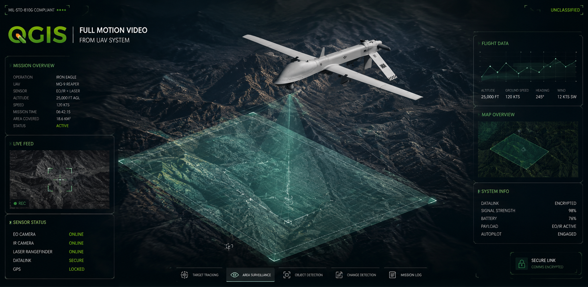
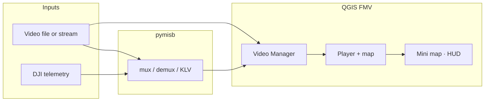

<p align="center">
  
</p>

<h1 align="center">QGIS Full Motion Video</h1>

<p align="center">
  <strong>Play MISB video. See telemetry on the map. Work in QGIS.</strong>
</p>

<p align="center">
  <a href="https://github.com/All4Gis/QGISFMV"></a>
  <a href="LICENSE"></a>
  <a href="USAGE.md"></a>
  <a href="https://pypi.org/project/pymisb/"></a>
</p>

<p align="center">
  <a href="USAGE.md">User guide</a> ·
  <a href="ARCHITECTURE.md">Architecture</a> ·
  <a href="https://all4gis.github.io/QGISFMV/">Docs site</a> ·
  <a href="CONTRIBUTING.md">Contributing</a> ·
  <a href="https://github.com/All4Gis/QGISFMV/discussions">Discussions</a> ·
  <a href="https://github.com/All4Gis/QGISFMV/issues">Issues</a>
</p>

---

## What it does

QGIS FMV brings **Full Motion Video** into your GIS workspace: synchronized map layers (platform, footprint, sensor cone, trajectory), MISB/KLV metadata, drawing tools on video, mosaics, streams, and DJI → STANAG 4609 multiplexing.

Telemetry is handled by **[pymisb](https://pypi.org/project/pymisb/)** on PyPI. The plugin focuses on QGIS integration, playback, and geospatial visualization.


```mermaid
flowchart LR
  subgraph inputs [Inputs]
    V[Video file or stream]
    T[DJI telemetry]
  end
  subgraph pymisb [pymisb]
    M[mux / demux / KLV]
  end
  subgraph plugin [QGIS FMV]
    VM[Video Manager]
    P[Player + map]
    M3[Mini map · HUD]
  end
  V --> M
  T --> M
  M --> VM
  V --> VM
  VM --> P
  P --> M3
```

<p align="center">
  
</p>

---

## Highlights

| Feature | What you get |
|---------|--------------|
| **Live map symbology** | Platform, footprint, beams, trajectory, frame center — updated with playback |
| **MISB / KLV** | Embedded metadata via pymisb; CSV/PDF export, ffprobe tree, bitrate plots |
| **Playback** | OpenCV decode, scrubbing, loop, record clip, frame export |
| **Video Filters** | 25+ real-time filters: CLAHE, Sharpen, Sobel, vegetation indices, motion, dehaze, hotspot |
| **AI Detection** | **Filters → AI Detection**: VisDrone YOLO (vehicle/person) + smart CV (building, road, fire, smoke, flood) — tuned for FMV/UAV |
| **Multiplexer** | Build MISB `.ts` from DJI video + `.csv` / `.txt` / `.log` telemetry |
| **Streams** | UDP, TCP, RTP, RTSP from **File → Open Stream** |
| **FMV Tools** | HUD, mini map, alerts, geofence, bookmarks, mission ZIP |
| **Geo-intelligence** | **Map Time Machine**, **Lookback**, **Target Pin/Cue**, click-to-seek, AI→map, Detection Sentinel, Instant Replay, storyboard, place labels, heat trail, cinematic follow |
| **On-video tools** | Draw, measure, magnifier, censor, stamp, object tracking, **military symbols** |
| **Movable toolbar** | Draw toolbar is floatable and dockable; position persists across sessions |
| **Mosaic** | Incremental georeferenced mosaic with feathering and performance controls |
| **FMV Settings** | FFmpeg, DEM, layer names, **AI Detection (YOLO/ONNX)** — no hand-editing `settings.ini` required |

---

## Install

### QGIS Plugin Manager (recommended)

**Plugins → Manage and Install Plugins** → search **QGIS FMV** → **Install Plugin**

### Release ZIP

Download from [GitHub Releases](https://github.com/All4Gis/QGISFMV/releases) → **Plugins → Install from ZIP**

### Dependencies

| Component | Required | Notes |
|-----------|----------|-------|
| **QGIS 4.x** | Yes | Qt6 / PyQt6 — QGIS 3 is not supported |
| **FFmpeg** | Yes | Configure in **FMV Settings** (toolbar gear) |
| **pymisb** | Yes | Listed in `code/requirements.txt` |
| **OpenCV** | Recommended | Filters, tracking, **YOLO/ONNX DNN** (`opencv-contrib-python` in requirements) |
| **matplotlib** | Optional | Bitrate plots |
| **DEM** | Optional | GeoTIFF/HGT for ground intersection |

**Developers** — `install_dev.sh` symlinks the plugin and installs runtime deps into **QGIS bundled Python**:

```bash
./install_dev.sh          # macOS
# install_dev.bat         # Windows
# bash scripts/install_plugin_requirements.sh   # deps only
```

Runtime packages are defined in **`code/requirements.txt`** (not a local `python_deps/` folder).

End users: first run can offer guided setup via **FMV Settings → Install dependencies**.

---

## Quick start

1. Open QGIS → click **FMV** on the toolbar.
2. **File → Open Video File** (or drag & drop onto the manager).
3. Wait until status is **Ready** (telemetry index on long files).
4. **Double-click** the row → player opens; map layers follow the video.

**No MISB metadata?** → **File → Create MISB File** (multiplexer). Details in [USAGE.md](USAGE.md#multiplexer).

### Sample videos

Download sample MISB test videos from [Google Drive](https://drive.google.com/file/d/137JaQwx5kVwhdcrxwTCSgxqBbaOjW9be/view) to try the plugin.

---

## Video Filters

25+ real-time filters in the player **Filters** menu, plus a dedicated **AI Detection** submenu for FMV/UAV imagery.

| Category | Filters |
|----------|---------|
| **Enhancement** | CLAHE, Sharpen, Brightness/Contrast, Auto Contrast, Dehaze, Road Enhancement |
| **Edge Detection** | Canny Edge, Sobel |
| **Color & Vegetation** | False Color (Turbo LUT), ExG, ExR, VARI, NRVI |
| **Motion** | Motion Detection, Background Subtraction (MOG2), Hotspot Detection |
| **AI Detection** | See table below — YOLO + smart CV, aerial-tuned defaults |
| **Quick** | Gray Scale, Invert Colors, Mono, Mirror Horizontal |

### AI Detection (FMV / UAV)

Open **Filters → AI Detection** in the player:

| Filter | Engine | Notes |
|--------|--------|-------|
| **Vehicle (YOLO AI)** | VisDrone YOLOv8n + CV fallback | Cars, trucks, buses, vans on aerial video |
| **Person (YOLO AI)** | VisDrone YOLOv8n + CV fallback | Pedestrians / cyclists in FMV |
| **Building (CV + AI)** | Smart CV (+ optional custom ONNX) | Structured roofs, edges, low vegetation |
| **Road (CV + AI)** | Smart CV (+ optional ONNX) | Asphalt segmentation + lane hints |
| **Fire / Smoke / Flood (CV + AI)** | Smart CV (+ optional ONNX) | Color/texture signatures for incidents |

Configure models in **FMV Settings → AI Detection**:

- One-click **Download VisDrone aerial model** (YOLOv8n → ONNX, stored in `~/.qgis-fmv-models/`)
- Profile **aerial** (FMV/UAV) vs **coco** (ground-level) vs **custom** class IDs
- Confidence, NMS, per-filter ONNX overrides

Advanced tuning in `code/settings.ini` → `[FILTERS]` (aerial profile, multiscale, NMS, tracking, overlay thresholds). See [USAGE.md](USAGE.md#ai-detection).

All filters use OpenCV when available; pure-numpy fallbacks when OpenCV is blocked (e.g. macOS Team ID).

---

## Documentation

All documentation lives in this repository as Markdown files (no separate docs site):

| Doc | Audience |
|-----|----------|
| [**USAGE.md**](USAGE.md) | End users — manager, player, tools, shortcuts |
| [**CONTRIBUTING.md**](CONTRIBUTING.md) | Developers — setup, tests, project layout |
| [**CODING_STANDARDS.md**](CODING_STANDARDS.md) | Python / PyQt conventions |

---

## Development

```bash
git clone https://github.com/All4Gis/QGISFMV.git && cd QGISFMV

pip install -r requirements-dev.txt
python3 build.py          # UI + resources + i18n (outside QGIS)

./install_dev.sh          # macOS — symlink + deps → ~/.qgis-fmv-packages
# install_dev.bat         # Windows
./debug_qgis.sh           # launch QGIS with FRAN_DEBUG=1 → Attach in Cursor
```


Release ZIP: `python3 deploy/plugin_zip.py`

```
QGISFMV/
├── code/                   # Plugin source (symlinked as QGISFMV)
│   ├── QgsFmv.py           # Plugin entry
│   ├── manager/            # Playlist, multiplexer, streams
│   ├── player/
│   │   ├── QgsFmvPlayer.py
│   │   ├── dialogs/        # Metadata, settings, military symbols
│   │   ├── overlays/       # HUD, mini map, sensor cone, distance rings
│   │   ├── drawing/        # On-video draw toolbar
│   │   └── features/       # Mosaic, timeline, alerts, snapshots
│   ├── video/              # Playback, filters, DNN (see subfolders)
│   │   ├── playback/       # QgsVideo widget, surface, state
│   │   ├── filters/        # VideoFilters, detection, worker
│   │   └── dnn/            # ONNX / VisDrone setup
│   ├── utils/
│   │   ├── settings/       # settings.ini + QgsFmvSettings
│   │   ├── layers/         # Map layers, styles, KML/GPX export
│   │   ├── media/          # Multimedia, ffmpeg, KLV, streams
│   │   ├── core/           # QgsFmvUtils (georef runtime)
│   │   ├── ui/             # Resources, QgsUtils, plots
│   │   ├── logging/        # stdlib logging (`utils/logging/__init__.py`)
│   │   ├── install/        # Dependency installer
│   │   └── vision/         # Object tracking
│   ├── geo/                # Geodesy helpers
│   ├── about/              # About dialog
│   ├── gui/                # Generated PyQt6 (run build.py)
│   ├── ui/                 # Qt Designer sources
│   ├── images/             # Icons, platform SVGs, military symbols
│   ├── i18n/               # Translations
│   └── requirements.txt    # Runtime Python deps (pymisb, OpenCV, matplotlib)
├── scripts/
│   └── install_plugin_requirements.sh
├── assets/                 # Doc screenshots
├── build.py                # Compile .ui / .qrc / .ts
└── deploy/                 # Plugin ZIP builder
```

---

## Standards & references

- [MISB ST 0601](http://www.gwg.nga.mil/misb/docs/standards/ST0601.17.pdf) — UAS Datalink Local Set
- [MISB ST 0102](https://gwg.nga.mil/misb/docs/standards/ST0102.12.pdf) — Security Metadata
- [STANAG 4609](http://www.gwg.nga.mil/misb/docs/nato_docs/STANAG_4609_Ed3.pdf) — Motion Imagery

---

## Support the project

### Community (free)

Use the plugin at no cost under [GPL-3.0](LICENSE). Ask in [Discussions](https://github.com/All4Gis/QGISFMV/discussions) or report bugs in [Issues](https://github.com/All4Gis/QGISFMV/issues).

### Donate

[](https://www.paypal.com/donate/?hosted_button_id=X2JMP4FMHDYQS)

Individual donations help sustain development.

---

## License

**GPL v3** — [LICENSE](LICENSE)

**Francisco Raga** · [All4Gis](https://github.com/All4Gis) · franka1986@gmail.com
