# Usage Guide

Everything you need to run **QGIS Full Motion Video** — from opening a file to advanced tools.

<p align="center">
  <a href="README.md">README</a> ·
  <a href="CONTRIBUTING.md">Contributing</a>
</p>

---

## Contents

1. [Requirements](#requirements)
2. [Workflow](#workflow)
3. [FMV Settings](#fmv-settings)
4. [Video Manager](#video-manager)
5. [Multiplexer](#multiplexer)
6. [Video Player](#video-player)
7. [Map & layers](#map--layers)
8. [Video Filters](#video-filters)
9. [AI Detection](#ai-detection)
10. [FMV Tools](#fmv-tools)
11. [Draw toolbar](#draw-toolbar)
12. [Military symbols](#military-symbols)
13. [Keyboard shortcuts](#keyboard-shortcuts)
14. [Troubleshooting](#troubleshooting)

---

## Requirements

| Item | Details |
|------|---------|
| **QGIS** | **4.x** (Qt6). QGIS 3 is not supported. |
| **Video** | MISB/STANAG 4609 with KLV, or create one via multiplexer |
| **FFmpeg** | Required — paths in **FMV Settings** |
| **Python** | `opencv-contrib-python`, `matplotlib`, `pymisb` — see `code/requirements.txt` |
| **DEM** | Optional GeoTIFF/HGT for terrain intersection |

> **Tip:** Use the **FMV Settings** button (gear on toolbar) instead of editing `settings.ini`.

**Playback** uses OpenCV (no GStreamer / LAV Filters). **Live streams** supported: UDP, TCP, RTP, RTSP via **File → Open Stream**.

**Developers:** run `./install_dev.sh` (macOS) or `install_dev.bat` (Windows) to symlink the plugin and install runtime packages into QGIS bundled Python.

---

## Workflow

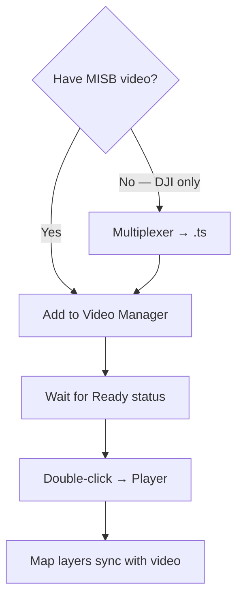

---

## FMV Settings

**Toolbar → FMV Settings** (or **Plugins → Full Motion Video → FMV Settings**)

Configure in one place:

- **FFmpeg / ffprobe** folder
- **DEM** (optional elevation model)
- **Reverse geocoding** URL
- **Layer names** used when creating video groups
- **Mosaic** live mosaic tuning (interval, feather, max size)
- **AI Detection** — YOLO/ONNX models, VisDrone download, confidence, class IDs
- **Dependency check** — pymisb, OpenCV, FFmpeg status
- **Install dependencies** — guided setup when available

Changes are saved to **`code/settings.ini`** (plugin root) and applied without restarting QGIS.

### AI Detection tab

**FMV Settings → AI Detection**

| Control | Purpose |
|---------|---------|
| **Use YOLO/ONNX** | Enable OpenCV DNN for supported filters |
| **Model profile** | **aerial** (VisDrone, FMV/UAV) · **coco** (ground-level) · **custom** |
| **Download VisDrone** | One-click YOLOv8n download + ONNX export to `~/.qgis-fmv-models/` |
| **ONNX path** | Override model file (absolute path) |
| **Confidence / NMS** | Detection thresholds (try **0.15** confidence for small aerial objects) |
| **Per-filter class IDs** | Comma-separated YOLO class indices per filter |
| **Per-filter ONNX** | Optional separate `.onnx` per filter (building, road, fire, …) |

**VisDrone class IDs (default for aerial):**

- Vehicle: `3,4,5,8,9` (car, truck, bus, van, …)
- Person: `0,1` (pedestrian, people)

Building, road, fire, smoke and flood use **smart CV** unless you assign a custom ONNX and class IDs.

---

## Video Manager

Central dock for your playlist.

### Add media

| Action | Menu |
|--------|------|
| Open file | **File → Open Video File** |
| Open stream | **File → Open Stream** |
| Create MISB | **File → Create MISB File** |
| Drag & drop | Drop files onto the table |

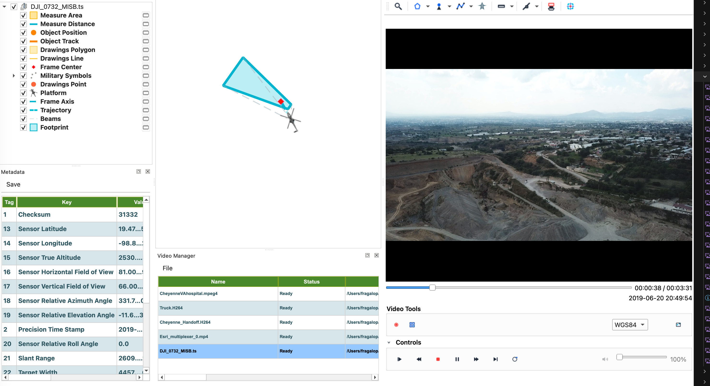

**Stream example (VLC → UDP):** VLC → open test video → **Media → Stream** → UDP → `127.0.0.1:5005`. In FMV: **Open Stream** → UDP → port `5005` → **Connect**. Double-click to play.

### Status column

| Status | Meaning |
|--------|---------|
| Indexing telemetry | Building KLV index (wait on long files) |
| Ready | Safe to play — layers will update |

### Play & remove

- **Double-click** a row → open or switch player.
- Right-click → **Remove from list**.

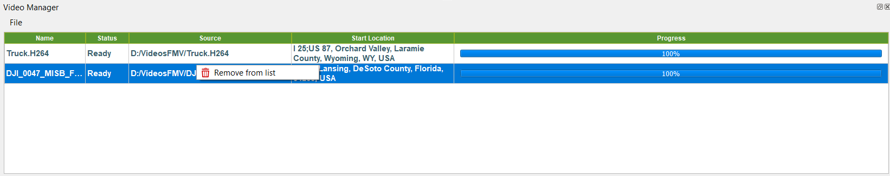

---

## Multiplexer

Creates **MISB STANAG 4609** MPEG-TS (video + audio + timed KLV) using **pymisb**.

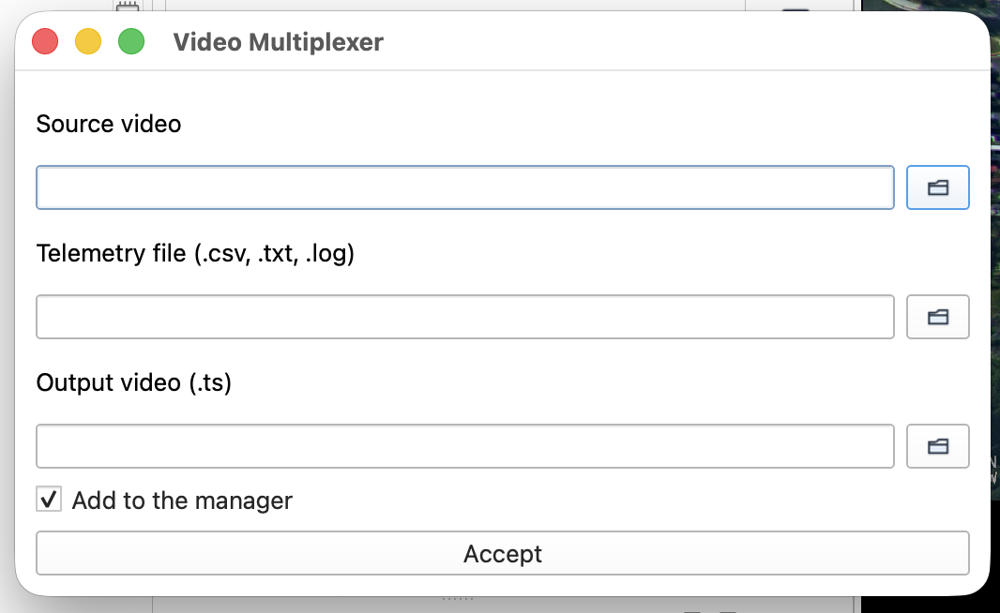

| Field | Description |
|-------|-------------|
| Source video | Original DJI (or compatible) recording |
| Telemetry | `.csv`, `.txt`, or `.log` flight log |
| Output | Destination `.ts` path |
| Add to manager | Load result when mux finishes |

### DJI telemetry sources

Flight records often live under `DJI/Dji.go.v4/FlightRecords`.

Convert to CSV if needed:

- [CsvView](https://datfile.net/CsvView/downloads.html)
- [DJI Flight Log Viewer](https://www.phantomhelp.com/logviewer/upload/)

### Steps

1. **File → Create MISB File**
2. Select video + telemetry
3. Confirm output `.ts`
4. **Accept** and wait for completion

Output has embedded KLV — no separate `klv/` folder.

---

## Video Player

Docked or floating window with video surface, timeline, and menus.

### Playback

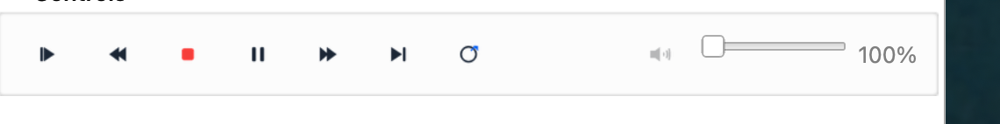

| Control | Action |
|---------|--------|
| Play / Pause | `Ctrl+P` |
| Stop | `Ctrl+S` |
| Seek | `←` `→` or slider |
| Loop | `Ctrl+L` |
| Record clip | `Ctrl+R` |
| Volume / mute | `Ctrl+U` |

Video decodes with **OpenCV**; audio export uses **FFmpeg**.

### Metadata dock

**Ctrl+T** — MISB tags for the current frame. Export **CSV** or **PDF**.

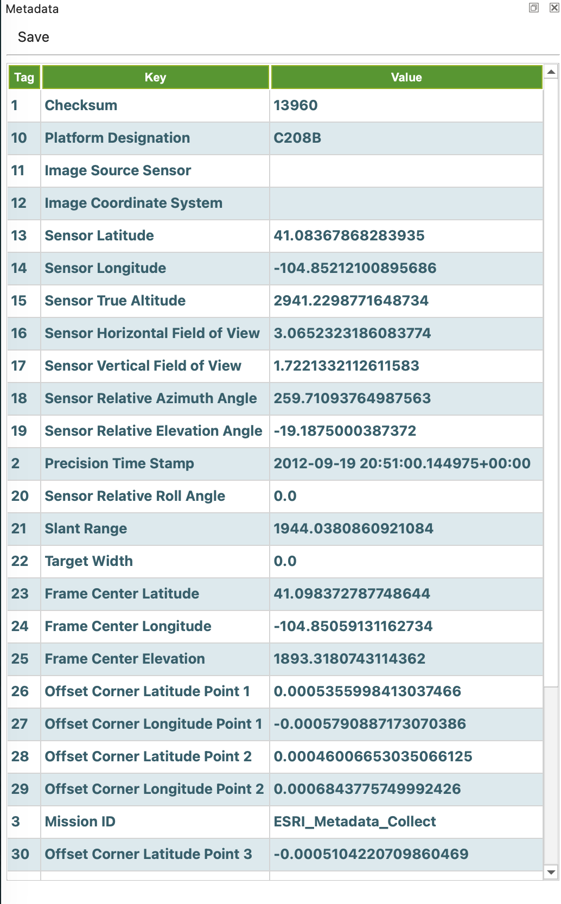

### Video menu

| Item | Description |
|------|-------------|
| Filters | Real-time enhancement, indices, motion — plus **AI Detection** submenu |
| Frames | Capture current / all / georeferenced |
| Video info | ffprobe JSON tree |
| Bitrate | Audio/video bitrate plots |
| Mosaic | Live georeferenced mosaic (`Ctrl+M` toolbar button) |
| Converter | Remux to another container |

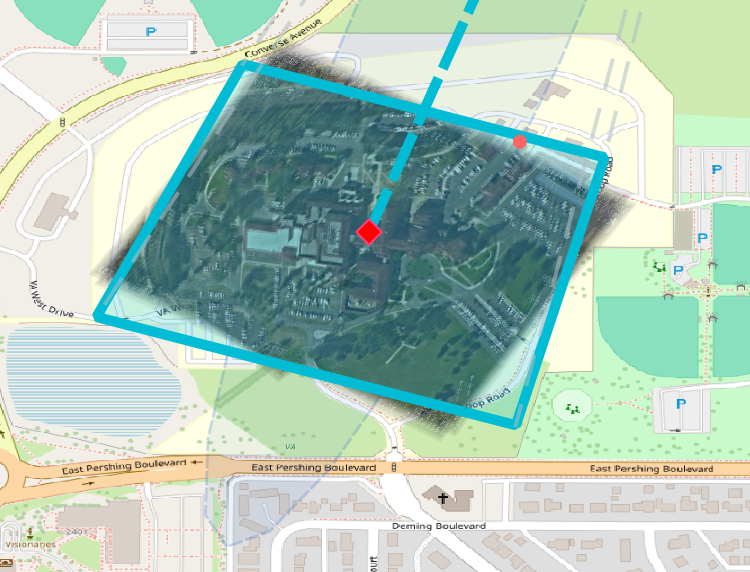

---

## Map & layers

Each video gets a **layer group** with symbology driven by telemetry:

| Layer | Content |
|-------|---------|
| Platform | Sensor position + heading (pick icon in **Options → Platform**) |
| Footprint | Ground footprint polygon |
| Beams | Sensor corner rays |
| Trajectory | Platform path (decimated for performance) |
| Frame Center / Axis | Target geometry |
| Drawings | User sketches on video |
| Military Symbols | APP-6D inspired symbols placed on video/map |
| Sensor Coverage Cone / Distance Rings | Optional C2 overlays from **FMV Tools** |

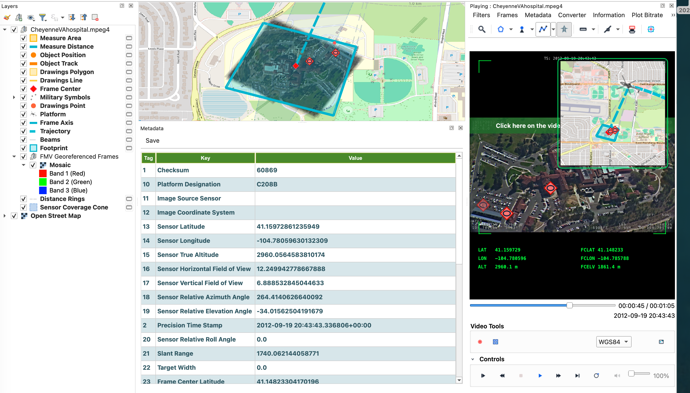

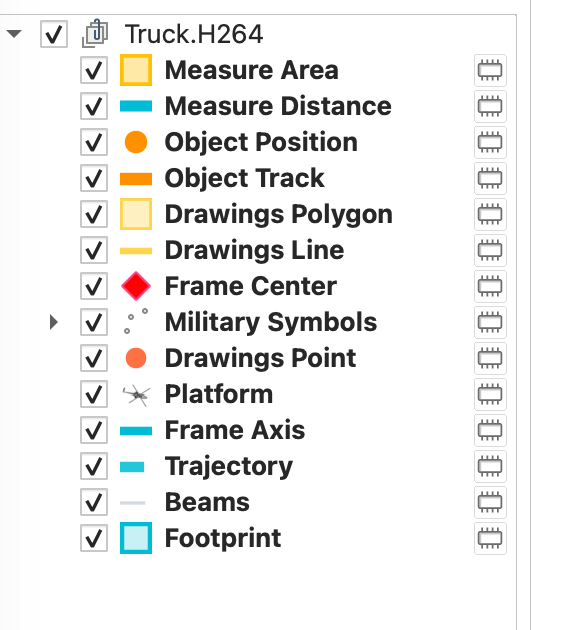

### Center modes

**Video → Center on Platform / Footprint / Target** — re-centers the QGIS map canvas on the active feature.

### Platform icon

**Options → Platform** tab — thumbnail picker from military, DJI, UAV, helicopter, ship, tank presets. Updates the map layer immediately.

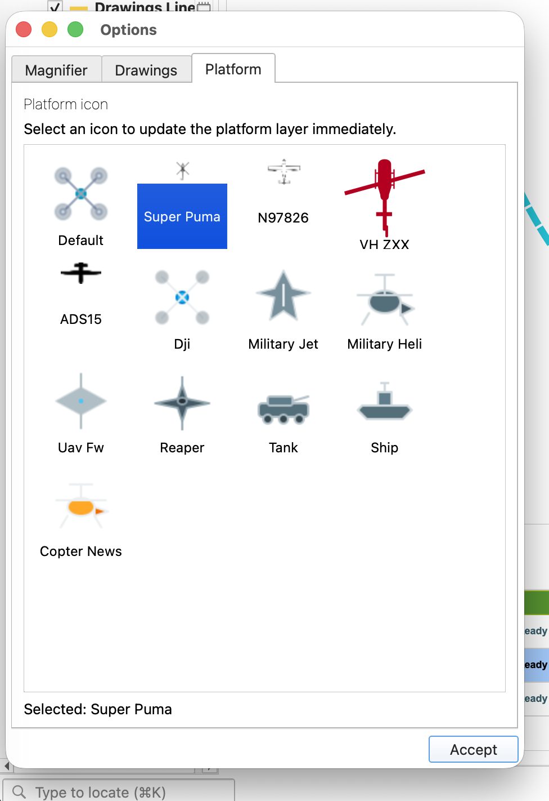

---

## Video Filters

Access via **Filters** menu in the player. All filters work in real-time during playback.

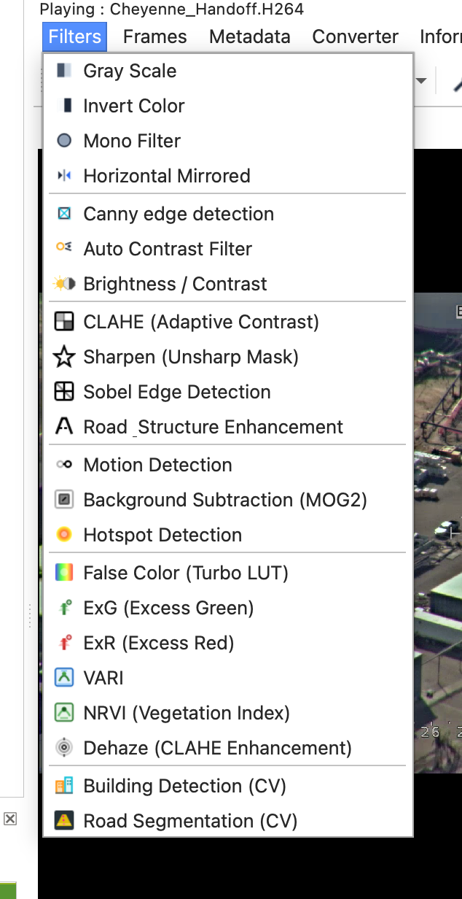

### Image enhancement

| Filter | Description |
|--------|-------------|
| **CLAHE** | Adaptive histogram equalization — improves contrast in shadows, fog, dark video |
| **Sharpen** | Unsharp mask — makes buildings, vehicles, roads more visible |
| **Brightness / Contrast** | Manual adjustment with slider dialog |
| **Auto Contrast** | Automatic CLAHE-based contrast |
| **Dehaze** | CLAHE + contrast stretch for foggy or low-visibility images |
| **Road Enhancement** | CLAHE + Sobel + Sharpen combined — highlights roads and structures |

### Edge detection

| Filter | Description |
|--------|-------------|
| **Canny Edge** | Classic Canny edge detection |
| **Sobel** | Sobel gradient magnitude — highlights structural edges, buildings, lines |

### Color & vegetation

| Filter | Description |
|--------|-------------|
| **False Color (Turbo)** | Rainbow LUT — makes intensity differences easy to interpret |
| **Vegetation Index (ExG/VARI)** | Excess Green index — NDVI equivalent for RGB cameras without NIR |

### Detection & motion

| Filter | Description |
|--------|-------------|
| **Motion Detection** | Frame difference — highlights moving objects with minimal cost |
| **Background Subtraction (MOG2)** | Adaptive background model — automatically detects moving objects |
| **Hotspot Detection** | Highlights brightest pixels (thermal cameras) in red overlay |

### AI Detection (summary)

Segmentation filters for buildings, roads, vehicles, persons, fire, smoke and flood live under **Filters → AI Detection**. See [AI Detection](#ai-detection) for YOLO setup, VisDrone, and `[FILTERS]` tuning.

### Quick filters

| Filter | Description |
|--------|-------------|
| **Gray Scale** | Convert to grayscale |
| **Invert Colors** | Invert pixel values |
| **Mono** | 1-bit monochrome |
| **Mirror Horizontal** | Flip video horizontally |

> **Note:** Only one "slow" filter can be active at a time (CLAHE, Sharpen, Sobel, AI Detection, etc.). Quick filters (Gray, Invert, Mono, Mirror) can combine with any slow filter.

---

## AI Detection

Designed for **FMV and UAV aerial video**. Open **Filters → AI Detection** in the player.


### Available filters

| Menu item | Primary engine | Fallback |
|-----------|----------------|----------|
| **Vehicle (YOLO AI)** | VisDrone YOLOv8n (ONNX) | Smart CV (blob + edge + motion) |
| **Person (YOLO AI)** | VisDrone YOLOv8n (ONNX) | Smart CV (vertical shape) |
| **Building (CV + AI)** | Smart CV | Optional custom YOLO ONNX |
| **Road (CV + AI)** | Smart CV + lane hints | Optional custom YOLO ONNX |
| **Fire (CV + AI)** | HSV warm-color CV | Optional custom YOLO ONNX |
| **Smoke (CV + AI)** | Low-saturation texture CV | Optional custom YOLO ONNX |
| **Flood (CV + AI)** | Blue/cyan water band CV | Optional custom YOLO ONNX |

### On-screen overlay

Each AI filter draws:

- **Colored tint** on high-confidence regions (adaptive thresholds for aerial video)
- **Bounding boxes** with optional **#track_id** and **confidence %** on each box
- **Status banner** at the top, e.g. `VEHICLE [YOLO] det:3 12%` or `BUILDING [CV] det:2 8%`

`[YOLO]` = OpenCV DNN; `[CV]` = classical computer vision; `[SCIPY]` / `[NUMPY]` = fallback without OpenCV.

### Setup (first time)

1. **FMV Settings → AI Detection**
2. Click **Download VisDrone aerial model** (or point **ONNX path** to your own model)
3. Enable **Use YOLO/ONNX for segmentation filters**
4. Keep profile **aerial** for FMV/UAV footage
5. Open a video → **Filters → AI Detection → Vehicle (YOLO AI)**

If YOLO finds nothing on a frame, the plugin automatically falls back to tuned CV when **dnn_fallback_when_empty** is enabled (default).

### Advanced tuning (`settings.ini`)

Section **`[DNN]`** — model path, profile, confidence, NMS, class IDs.

Section **`[FILTERS]`** — aerial detection profile (defaults optimized for FMV):

| Key | Default | Effect |
|-----|---------|--------|
| `profile` | `aerial` | Enables FMV-tuned thresholds |
| `overlay_abs_threshold` | `0.10` | Lower = more visible tint |
| `detection_percentile` | `70` | CV sensitivity |
| `clahe_pregain` | `true` | CLAHE before detection (haze) |
| `multiscale_detection` | `true` | Fuse full-res + half-res scores |
| `box_nms_iou` | `0.42` | Remove duplicate CV boxes |
| `show_box_confidence` | `true` | Labels on boxes |
| `tracking_enabled` | `true` | Stable `#id` across frames |
| `dnn_fallback_when_empty` | `true` | YOLO → CV when no DNN hits |

Template with comments: **`code/settings.sample.ini`**.

### Tips for aerial FMV

- Use **aerial** profile, not **coco**, for drone footage
- Lower **onnx_confidence** to `0.12–0.15` for very small vehicles
- Vehicle/Person need VisDrone; other classes need a **custom 7-class ONNX** if you want true YOLO for fire/smoke/etc.
- On macOS, if OpenCV is blocked by code signing, filters still run on numpy/scipy fallbacks (slower, fewer boxes)

---

## FMV Tools

Menu **FMV Tools** in the player:

| Tool | Shortcut | Description |
|------|----------|-------------|
| **HUD Overlay** | `Ctrl+H` | Telemetry overlay on video |
| **Mini Map** | `Ctrl+Shift+M` | PiP map — trajectory, footprint, platform, heading |
| **Auto Snapshots** | `Ctrl+Shift+S` | Periodic frame capture |
| **Enable Alerts** | — | Geofence / altitude alerts |
| **Export KML / GPX** | `Ctrl+Shift+K` / `Ctrl+Shift+G` | Export trajectory |

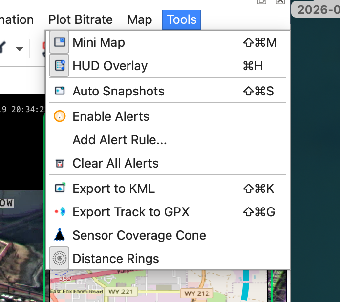

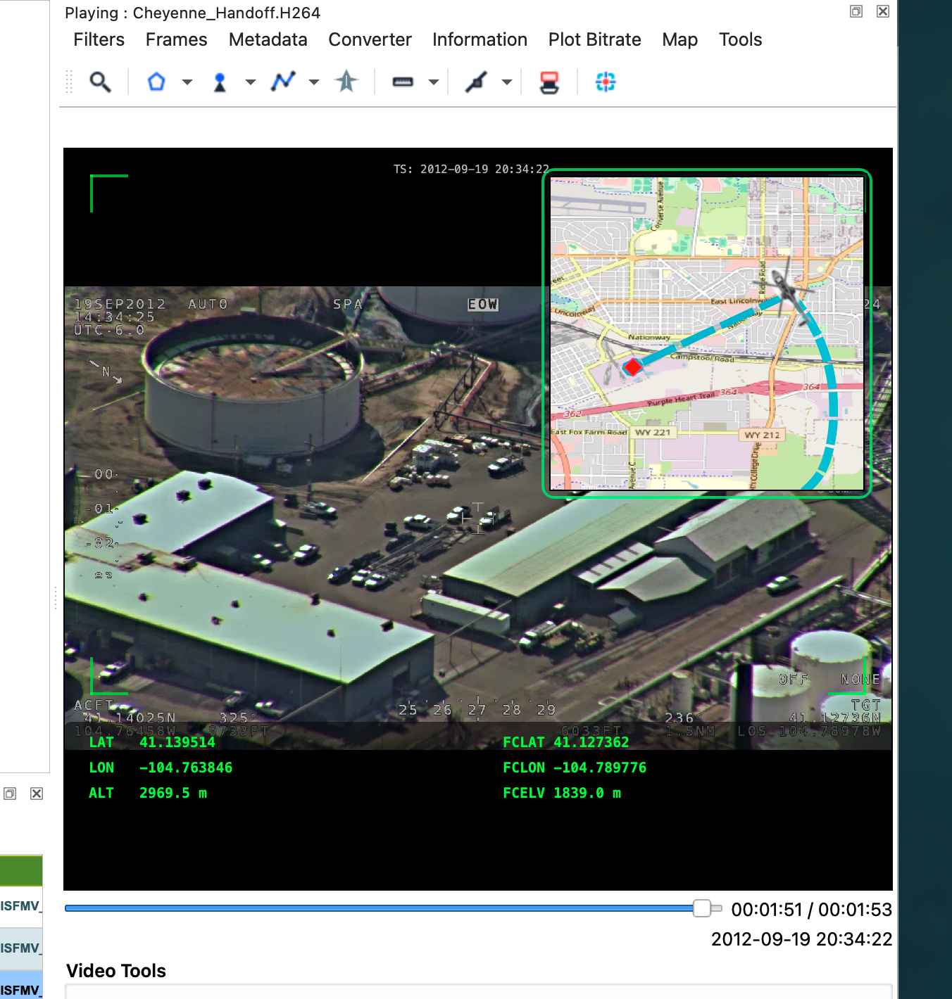

---

## Draw toolbar

The draw toolbar is **movable and floatable** — drag it to any edge of the player window, or float it outside. Its position and visibility persist across sessions.

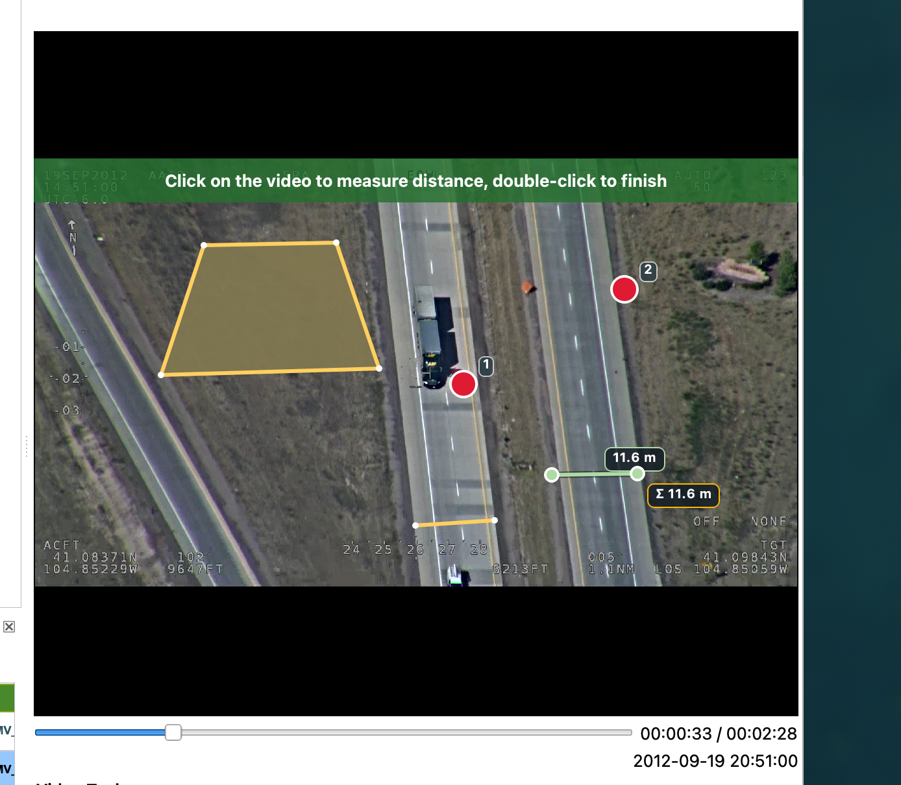

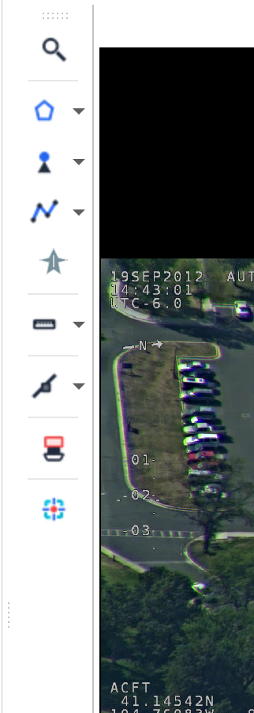

### Show / hide the toolbar

- **Right-click on the video** → **ToolBars** → check/uncheck **Utils ToolBar**
- **Right-click on the menu bar** → **ToolBars** → same option


### Tools

| Tool | Use | Remove |
|------|-----|--------|
| **Magnifier** | ROI zoom (cached) | — |
| **Point** | Place numbered pins on video | Remove last / Remove all (dropdown) |
| **Polyline** | Draw lines on video | Remove last segment / Remove last / Remove all (dropdown) |
| **Polygon** | Draw polygons on video | Remove last / Remove all (dropdown) |
| **Measure Distance** | Click points to measure distance | Remove last / Remove all (dropdown) |
| **Measure Area** | Click points to measure area | Remove last / Remove all (dropdown) |
| **Hand draw** | Freehand line | — |
| **Censor** | Black out regions | Remove last / Remove all (dropdown) |
| **Stamp** | e.g. Confidential overlay | — |
| **Object tracking** | OpenCV MOSSE tracker | — |
| **Military Symbols** | Place NATO APP-6D symbols | Remove last / Remove all (dropdown) |

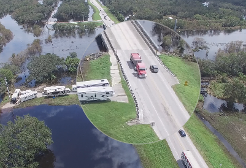

### Tool placement hints

When you activate a drawing or measurement tool, a **flashing green banner** appears on the video telling you how to use it (e.g. "Click here to place a point", "Double-click to finish line"). The hint disappears after a few seconds or when you deactivate the tool.

### Options

Right-click the draw toolbar for options: magnifier size, colors, line styles.

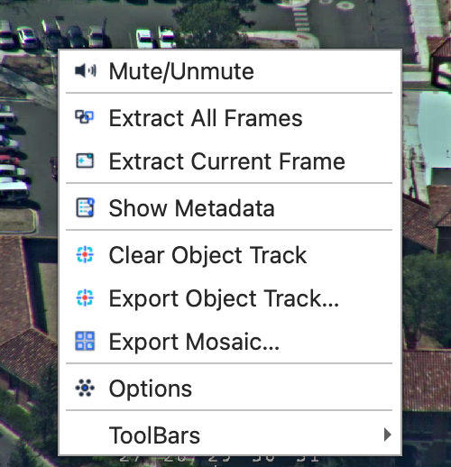

---

## Military symbols

Place **NATO APP-6D inspired** symbols on the georeferenced video and map.

**Draw toolbar → Military Symbols** (or the toolbar action in the player).

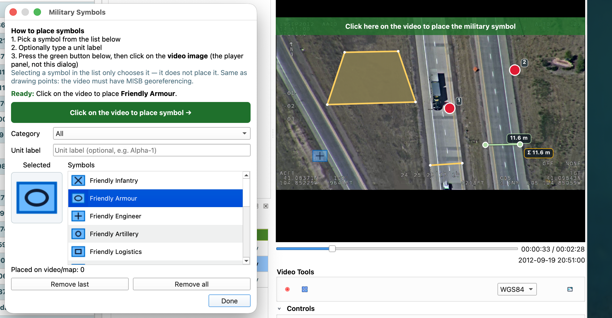

### Steps

1. Open the **Military Symbols** dialog.
2. Pick a **category** (Friendly, Hostile, Neutral, Special) and symbol from the list.
3. Optionally enter a **unit label** (e.g. Alpha-1).
4. A **placement hint banner** appears on the video.
5. Click on the **video image** (not the dialog) at the target location.
6. Symbol appears on video and in the **Military Symbols** map layer.

### Manage placements

| Action | Where |
|--------|-------|
| Remove last | Dialog button or draw toolbar dropdown |
| Remove all | Dialog button or draw toolbar dropdown |
| Undo last on map | Same as remove last |

Symbols require valid georeferencing (GCP / MISB metadata). SVG assets live in `code/images/military/`.

---

## Keyboard shortcuts

### Global

| Shortcut | Action |
|----------|--------|
| `Alt+F` | Open / focus FMV |
| `Alt+A` | About |

### Player — transport

| Shortcut | Action |
|----------|--------|
| `Ctrl+P` | Play / pause |
| `Ctrl+S` | Stop |
| `Ctrl+L` | Loop |
| `Ctrl+R` | Record clip |
| `Ctrl+U` | Mute |
| `←` / `→` | Step frame |
| `Ctrl+←` / `Ctrl+→` | Jump start / end |

### Player — data & export

| Shortcut | Action |
|----------|--------|
| `Ctrl+T` | Metadata dock |
| `Ctrl+Q` | Capture frame |
| `Ctrl+A` | Extract all frames |
| `Ctrl+Shift+C` | Save metadata CSV |
| `Ctrl+Shift+P` | Save metadata PDF |

### Player — FMV Tools

| Shortcut | Action |
|----------|--------|
| `Ctrl+H` | HUD overlay |
| `Ctrl+Shift+M` | Mini map |
| `Ctrl+Shift+S` | Auto snapshots |
| `Ctrl+Shift+K` | Export KML |
| `Ctrl+Shift+G` | Export GPX |

---

## Troubleshooting

### Map stays empty while video plays

- Confirm MISB/KLV data stream exists (multiplexed `.ts`).
- Wait until manager shows **Ready**.
- Check layers are visible in the project tree under the video group.

### Trajectory connects loop start/end on repeat

- Fixed in recent builds — update plugin. Each loop should start a new segment.

### Multiplexer fails

- Verify FFmpeg path in **FMV Settings**.
- Check telemetry format (CSV columns or DJI `.txt` / `.log`).
- Ensure output folder is writable.

### Missing OpenCV / pymisb

**End users:** open **FMV Settings → Install dependencies** or check the dependency status panel.

**Developers:**

```bash
./install_dev.sh                              # macOS — symlink + requirements
bash scripts/install_plugin_requirements.sh   # deps only
```

Use the **same Python as QGIS** — do not `pip install --user` OpenCV on macOS (breaks signed QGIS). The FMV Settings dependency check shows which interpreter is in use.

### Black screen on Windows

Install OpenCV via requirements. Set FFmpeg path. Try **Video → Converter** to remux unusual containers.

### Military symbol does not appear on map

- Video must be georeferenced (MISB metadata or valid GCP).
- Click on the **video surface**, not the symbol dialog.
- Check the **Military Symbols** layer is visible under the video group.

### AI Detection shows `det:0 0%` or `[CV]` only

- Open **FMV Settings → AI Detection**: profile must be **aerial** for FMV/UAV (not **coco**).
- Click **Download VisDrone** or set **ONNX path** to a valid `.onnx` file and enable **Use YOLO/ONNX**.
- Vehicle/Person use VisDrone; if YOLO returns no boxes, CV fallback runs automatically.
- Tune `[FILTERS]` in `settings.ini` — lower `overlay_abs_threshold` or `detection_percentile` for more sensitivity.
- Ensure OpenCV works (**FMV Settings** dependency panel). Without OpenCV, only numpy/scipy CV runs.

### Filters don't show visible change

- Ensure OpenCV is installed (`pip install opencv-contrib-python`).
- Some filters (Motion Detection, Background Subtraction) need video playback to show results.
- Check the Filters menu — only one "slow" filter can be active at a time.

---

<p align="center">
  <sub>QGIS FMV · <a href="README.md">README</a></sub>
</p>
