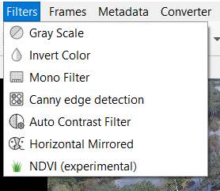
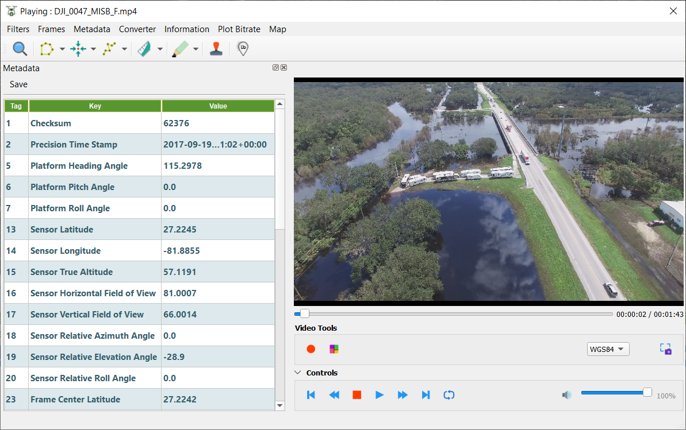
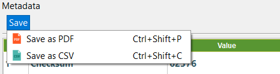
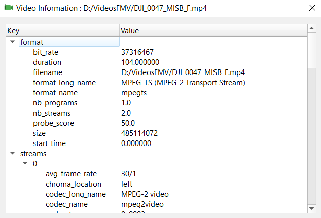
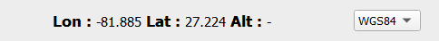
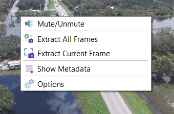
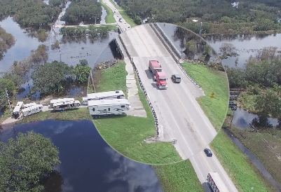

# How use QGIS FMV #

For the use of the QGIS FMV plugin you must have the [requirements](../index.md#dependencies) previously installed.

Once you have them, click on the icon that will appear in QGIS, to open the manager.  

# Table of Contents

- [Video Manager](#video-manager)
- [Video Player](#video-player)
	- [General Tools](#general-tools)
	- [Utils Toolbar](#utils-toolbar)
	- [Customize Plugin](#customize-plugin)
- [Shortcuts](#shortcuts)

##  Video Manager

From the manager, you can open and manage your play list.
For adding a video, simply click on **File -> Open Video File** and select a video from the dialog window to add it to the play list.
If you want to play a video after adding it to the play list, *double-click* on any video in the manager and the player will be opened playing the selected video. 
For playing another video, it is not necessary to close the player, just click on a different video and it will be played.

If you want to remove it from the list, click on the selected video, click on the mouse right button hover on row that you want and then on **Remove fron list**.

## Video Player

The player is the plugin core and the most important part. 

### General Tools

The options offered are the following:

- **Filters**: This option applies the selected filter on the video in real time.

- **Frames**: this option extracts the current frame, all the frames of the video or capture current georeferenced frame. To do it, you have to select one of these options and to select the destination directory; 
then, a background process will start that will store the current frame or all the video frames in this folder.
- **Metadata**: this option opens a dock, where you can see the information extracted from the video.This dock can move where we want.

If we want to save the information about the current frame we can do it in a **.csv** file or in a more elaborated report in **.pdf**.
For them, simply click on **Save** and select option.

	

- **Conversion**: this option allows to convert the video into a different format. To do it, you have to select the corresponding extension in the save dialog window.
- **Video information**: this option allows to save the video information in json format o to show the information in a dialog window.

- **Plot**: this option allows to show or save the information about the audio or video channels.If the video has no audio, the audio options are disabled
- **Map**: this option centers the map on the platform, footprint or target.If we deactivate any of the options, the centering is free for the user.
- **Record**: this option extracts parts of the video and store them in the destination directory.
- **Mosaic**: this option extracts all the georeferenced frames in real time and adds them to the canvas in a new group. While the button is checked its function is performed.
- **Cursor Coordinates**: this option allows you to see the cursor coordinates in WGS84 or MGRS (Military Grid Reference System)

The player also offers the typical options such as stop, rewind, fast-forward, go to the first or last frame and volume controller.

If we want to hide these options, simply click on 

If we right click on the video we can see a menu, with the options that we see in the following image.

### Utils Toolbar

The options offered are the following:

- **Magnifying Glass**: this option zooms the part of the video in which the magnifying glass is located. To use it, we can left click on the video or if we want to move it fluidly,, we must keep pressing the left click and move the mouse.

### Customize Plugin

## Shortcuts

Some options are also available through keyboard shortcuts and clicking on the mouse right button on the video.

| Shortcut Keys | Description |
| ------ | ------ |
| Alt+F | Open FMV |
| Alt+A | Show about |
| Ctrl+T | show metadata/telemetry dock |
| Ctrl+R | Record Video |
| Ctrl+M | Create mosaic from video |
| Ctrl+Q | Capture Current Frame |
| Ctrl+U | Mute/Unmute |
| Ctrl+A | Extract All Frames |
| Ctrl+Shift+P | Save metadata/telemetry as PDF |
| Ctrl+Shift+C | Save metadata/telemetry as CSV |
| Ctrl+Left | Start Of Media |
| Left | Rewind |
| Ctrl+S | Stop |
| Ctrl+P | Play/Pause |
| Right | Forward |
| Ctrl+Right | End Of Media |
| Ctrl+L | Repeat |

*Enjoy!*
