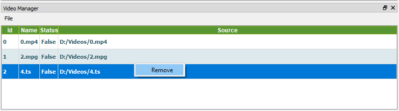
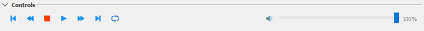
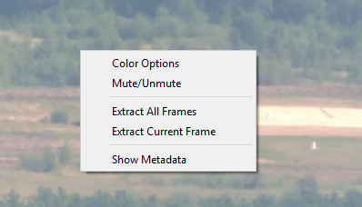

# How use QGIS FMV #

For the use of the QGIS FMV plugin you must have the [requirements](../index.md#dependencies) previously installed.

Once you have them, click on the icon that will appear in QGIS, to open the manager.

# Table of Contents
<!-- MarkdownTOC -->

- [Video Manager](#video-manager)
- [Video Player](#video-player)

<!-- /MarkdownTOC -->

### Video Manager

From the manager, you can open and manage your play list.
For adding a video, simply click on **Open** and select a video from the dialog window to add it to the play list.
If you want to play a video after adding it to the play list, *double-click* on any video in the manager and the player will be opened playing the selected video. 
For playing another video, it is not necessary to close the player, just click on a different video and it will be played.

If you want to remove it from the list, click on the selected video, click on the mouse right button and then on **Remove**.

### Video Player

The player is the plugin core and the most important part. 

The options offered are the following:

- **Frames**: this option extracts the current frame or all the frames of the video. To do it, you have to select one of these options and to select the destination directory; 
then, a background process will start that will store the current frame or all the video frames in this folder.
- **Metadata**: this option opens a dock, where you can see the information extracted from the video.
- **Conversion**: this option allows to convert the video into a different format. To do it, you have to select the corresponding extension in the save dialog window.
- **Video information**: this option allows to save the video information in json format o to show the information in a dialog window.
- **Plot**: this option allows to show or save the information about the audio or video channels.
- **Color**: this option allows to modify the video brightness, saturation and contrast.
- **Record**: this option extracts parts of the video and store them in the destination directory.

The player also offers the typical options such as stop, rewind, fast-forward, go to the first or last frame.

Some options are also available through keyboard shortcuts and clicking on the mouse right button on the video.

*Enjoy!*
